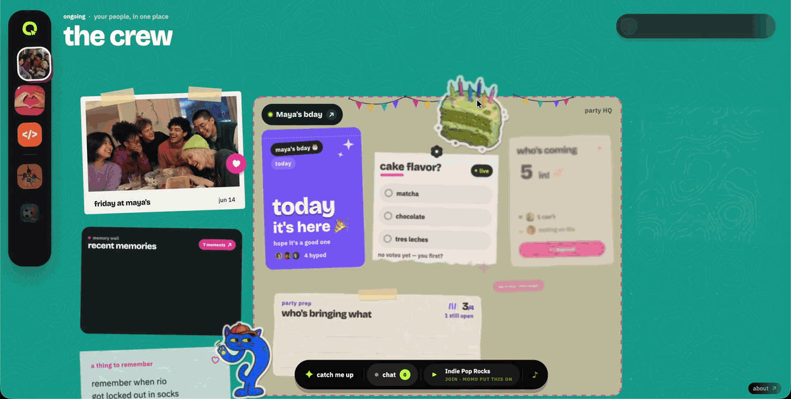
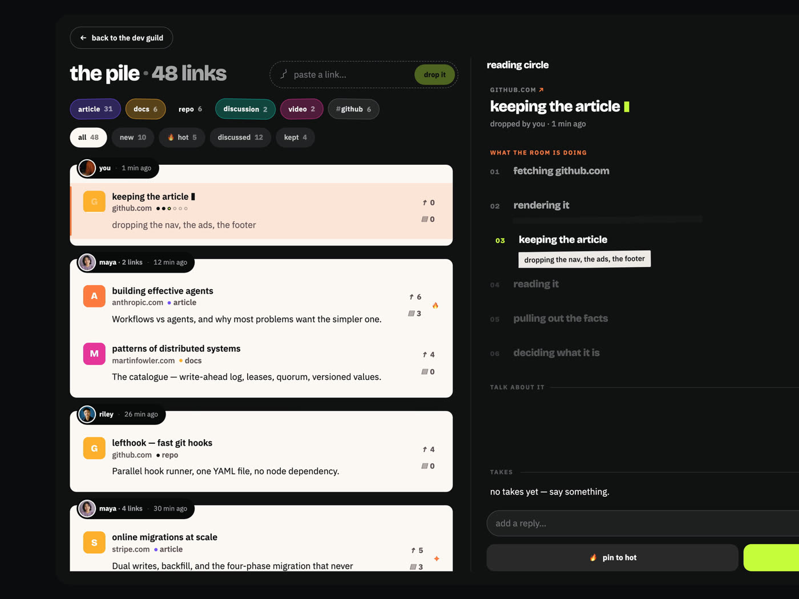
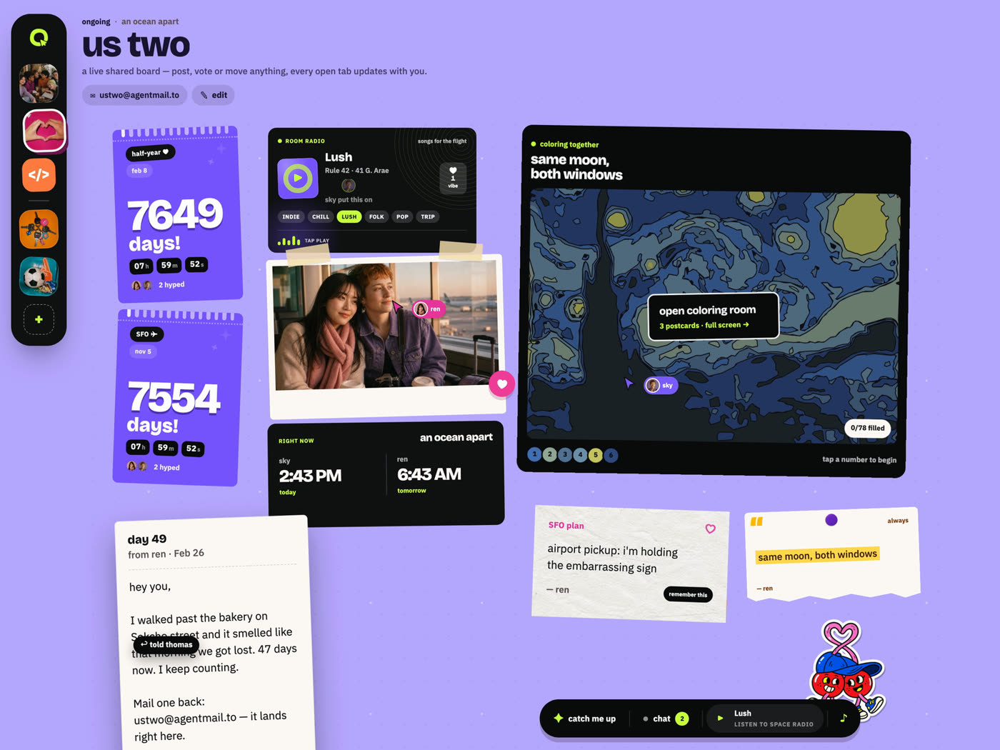
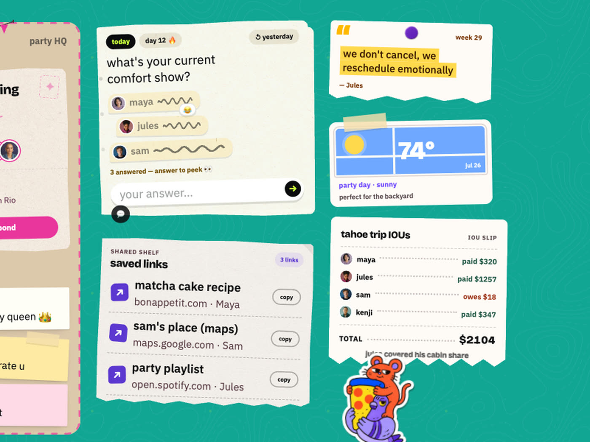

# OurSpaces

> Group chats forget. Spaces remember.

One page your whole group can mess with at the same time. Move a photo, vote on
the cake, claim what you're bringing, colour a picture together — it lands on
everyone's screen while they're still looking. And every space has its own
email address.

**Live, no signup:** https://ourspaces.io · **Video (2:56):**
https://www.youtube.com/watch?v=0VVFWbfX1QQ · **Build log:** [`hackathon.md`](hackathon.md)

Built for the [Convex All Gas Hackathon](https://www.convex.dev/hackathons/all-gas)
by Thomas Nguyen (build) and Holly Tran (design). Vibe coded with Codex in 26 days.

<p align="center"></p>

## Try it in a minute

1. Open [the crew](https://ourspaces.io/#/space/crew) in two tabs. Vote in one;
   the bar moves in the other, with the voter's face on it.
2. Drag a card. The other tab shows your cursor and the card moving.
3. Email a receipt to `ourspaces@agentmail.to`. A sealed letter lands on the
   board, the space files it as an expense split across the group, writes the
   reason on the slip, and emails you back.
4. Open [the build room](https://ourspaces.io/#/space/buildroom) and paste a
   link. It comes back as a card with a summary and two questions to argue about.

| the build room — Firecrawl reads every link | us two — a letter, a countdown, colouring together |
|---|---|
|  |  |



## Stack

Convex (database, live sync, auth, files, crons, hosting, and the **Convex AI
Gateway** for every model call) · Vite + React + TypeScript · Tailwind v4 ·
AgentMail · Firecrawl · OpenAI

## Convex depth

- **Components (17 used in code):** `static-hosting` (serves this site —
  `convex/staticHosting.ts`), `firecrawl` (scrape, web search, durable crawl),
  `agentMail` (our own first-party component in `convex/components/agentMail/`
  — create/send/reply/label over the AgentMail REST API, plus an inbound store
  with webhook dedup), `migrations`, `aggregate` (poll tallies + member counts
  as two *named instances* — `convex/votes.ts`, `convex/spaces.ts`),
  `sharded-counter` (global live totals), `rate-limiter` (LLM/mail/paint
  quotas), `action-retrier`, `action-cache` (scrape + question-gen caching),
  `workpool` (bounded recap fan-out), `workflow` (durable weekly digest),
  `batch-worker` (stale-link refresh queue), `agent` (ask-the-space threads),
  `rag` (semantic grounding for `recap.ask`), `persistent-text-streaming` (the
  ask answer types itself into the dock over `/api/ask-stream`, persisted so a
  reload or a second window reads the same one), `presence` ("N here").
  `aggregate` counts as its two instance names; `auth` is a library, not an
  `app.use`d component; `@convex-dev/ai-sdk-provider` is an AI SDK provider
  (`convex/ai.ts` imports `convexGateway` from it).
- **Convex Auth (`@convex-dev/auth`):** silent anonymous guest sessions, so
  every visitor has a real identity without a login form, plus optional join
  with a six-digit code emailed through AgentMail (`convex/auth.ts`,
  `convex/otp.ts`). The canvas is never behind a wall.
- **Schema:** 13 tables, 30 indexes, 1 full-text search index, 1 vector index —
  spaces, members, widgets (a 33-arm `data` union validating 32 widget types),
  messages, votes, paint marks, recaps, presence, ask streams, email events,
  saved room baselines. Every field carries a `v.` validator and every
  relation is a typed `v.id()` link (widgets, members, messages → spaces;
  votes → widgets); each index is a single or compound key matched to one
  access pattern. `widgets.by_embedding` powers "already on the board"
  (`convex/similar.ts`): arriving mail is embedded and `ctx.vectorSearch` asks
  if the room has it.
- **Realtime:** every in-space surface is a Convex subscription — no refetch,
  no invalidate-on-write, no hand-rolled sync. Each is a `useQuery` /
  `usePaginatedQuery` against an indexed query:

  ```ts
  // src/live/useSpaceData.ts — the whole board in one subscription
  const result = useQuery(api.spaces.getSpaceWithWidgets, mode === "live" ? { slug } : "skip");
  ```

  | surface | query | file |
  |---|---|---|
  | the canvas — any drag, resize, edit or delete lands for everyone | `spaces.getSpaceWithWidgets` | `src/live/useSpaceData.ts` |
  | cursors + gesture locks; `claimGesture`/`finishGesture` arbitrate writes | `presence.listHereNow` | `src/live/usePresence.ts` |
  | poll bars, with voter names; `pollTallies` aggregate for counts-only sites | `votes.getResults` | `src/live/useLivePoll.ts` |
  | collaborative paint-by-number marks | `paint.listBySpace` | `src/pages/LiveSpace.tsx` |
  | the thread — cursor pagination + a `search_text` full-text index | `messages.listBySpace` | `src/pages/LiveSpace.tsx` |
  | recap strip, rewritten by the cron | `recap.latest` | `src/pages/LiveSpace.tsx` |
  | "N here" — header, live strip and rail read one query, so they can't disagree | `roomPresence.onlineForSpace` | `src/components/Rail.tsx` |
  | global totals via `sharded-counter`; takes a `now` bucket re-keyed every 15s | `stats.getLiveCounts` | `src/pages/LiveBlock.tsx` |
  | crawled pages stream in as they arrive | `firecrawl.listCrawlPages` | `src/components/CrawlStrip.tsx` |
  | a publish patches the deployment row; open tabs are offered a refresh before lazy chunks 404 | `staticHosting.getCurrentDeployment` | `src/components/UpdateNudge.tsx` |

  Widget moves use `.withOptimisticUpdate()` (`src/live/useLiveHandlers.ts`);
  the gesture path keeps a hand-rolled one because `finishGesture` can refuse a
  commit and an optimistic update cannot read that verdict.
- **Functions:** 45 queries + 72 mutations + 34 actions = 151, every one with
  a `returns:` validator. Plus 6 HTTP actions (svix-verified inbound mail,
  `/api/ask-stream`), which return a `Response` and so have no `returns:` slot.
  All use the object syntax with `args` + `returns`. Every database read goes
  through `withIndex`, a search index or `ctx.vectorSearch`; there is no
  `.filter()` on a query anywhere in `convex/`. Queries only read, mutations
  only write, actions own every network call.
- **Scheduling:** 4 crons (stale-presence sweep every 5 min, daily recap via
  workpool, Friday digest via a durable workflow, Friday stale-link refresh) +
  scheduled functions. **File storage:** photo-wall uploads become prints.

## Sponsor stack, doing real work

- **AgentMail** gives every space a real inbox. Inbound mail is routed onto the
  canvas — sealed letter, link into the reading pile, or an AI-filed expense
  row / itinerary day — and the space **replies in-thread and labels** each
  message with what it did.
- **Firecrawl** turns pasted webpages into reactive rich-post widgets, powers
  **research a topic** (web search → cards) and **crawl a site** (durable crawl
  whose pages stream live into the reading room).
- **OpenAI via the Convex AI Gateway**, on a short-lived deployment credential
  rather than an API key we carry: `openai/gpt-4o-mini` for structured filing
  decisions and chat, `openai/text-embedding-3-small` (1536 dims) for rag and
  the echo index. It is a decider, never a chatbot UI — the reason is written on
  the object it filed.

## Run

```bash
npm install
npx convex dev        # once, to provision; writes .env.local
npm run dev           # frontend
npm run dev:backend   # convex dev
```
