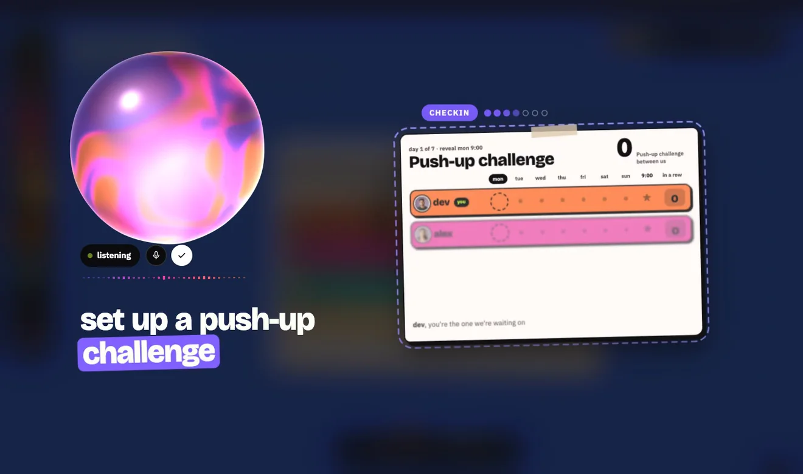
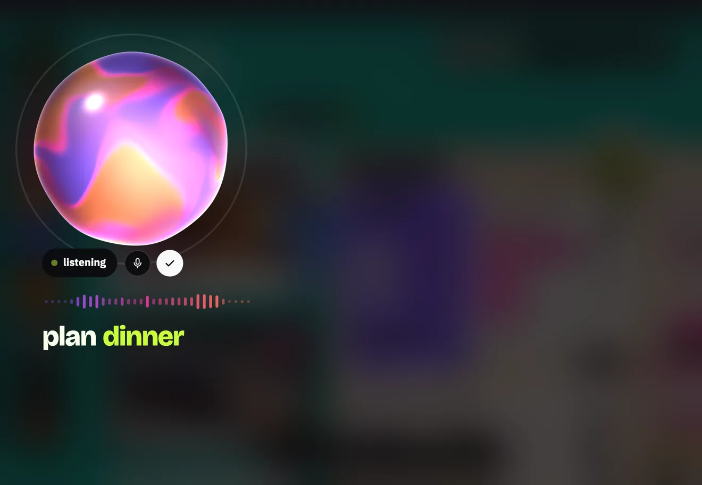
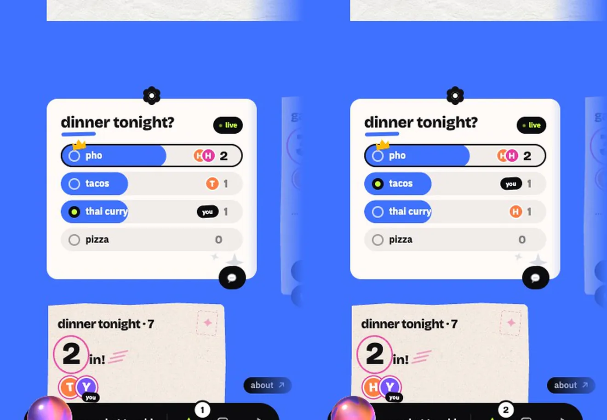
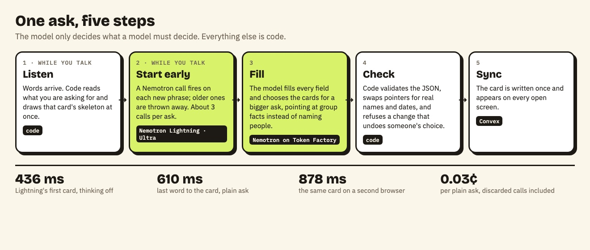
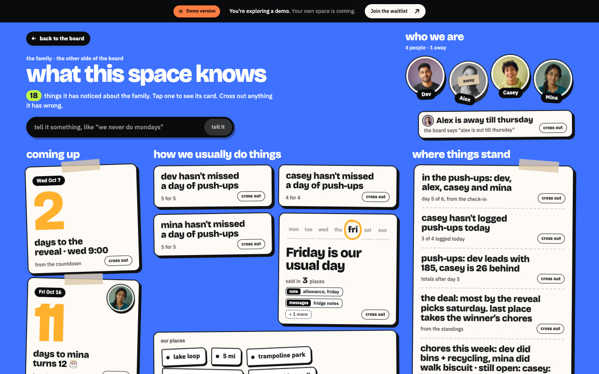
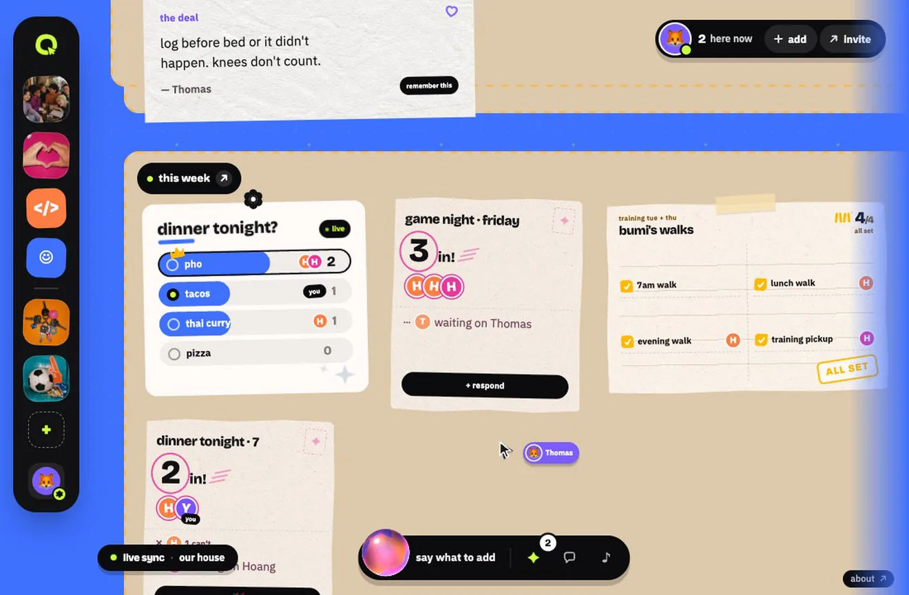

# OurSpaces

> Say "poll for Saturday" and it's on your friends' screens. The AI never cuts in.

A shared board for your group that builds itself when you talk to it. Tap the
orb, say what you need, and the card lands on everyone's screen in under a
second, filled in by **NVIDIA Nemotron on Nebius Token Factory**. Then it's a
normal card anyone can vote on, claim or drag.

**Live:** https://ourspaces.io · **Built for:** the Nebius × NVIDIA Global AI
Hackathon · **By** Thomas Nguyen (build) and Holly Tran (design)

<p align="center"></p>
<p align="center"><sub>"Set up a push-up challenge for the four of us": six linked cards on every screen 1.6 s after the last word.</sub></p>

## What you can say

| You say | What happens on every screen |
|---|---|
| "Add a poll for Saturday dinner" | A real poll, 610 ms after your last word |
| "Who's driving to Maya's?" | A wheel with exactly the four people who said yes |
| "Set up a push-up challenge for the four of us" | Six linked cards: who's in, a check-in grid, face-down standings, the deal, a countdown |
| "Put the trade up for a vote, 24 hours" | A yes/no vote that closes for everyone at once |
| "When's Maya's birthday?" | A short answer, and the view moves to the card it came from |
| "Add a poll for cake flavor" (one exists) | Nothing new. It takes you to the poll that's already there |

<p align="center"></p>

## The AI waits its turn

An AI acting for a group fails in one way: it changes something a person is in
the middle of, or undoes something they already chose. We don't ask the model
to be careful. **The model proposes; a lease table in code decides.**

- A **lease** is a person's hand on a card: dragging it, typing in it, holding
  a vote. Every screen shows it as a halo with their name.
- An AI change to a held card **waits** as a ghost ("waiting for Sam") and
  lands when they let go.
- A change that would undo a vote or a claim **asks the people who made it**.

<p align="center"></p>

**Why not just ask the model?** We wrote 192 situations (a board, people's
hands and choices, one change the AI wants to make) and put each to Nemotron
Ultra:

| Who decides | Overrode a person (of 96) | Blocked a harmless change (of 96) | Added delay |
|---|---|---|---|
| Nemotron Ultra, "should it apply this now?" | 38 | 30 | 1,033 ms |
| Nemotron Ultra, with our rules in the prompt | 18 | 15 | 1,083 ms |
| The lease table in code | 0 | 0 | under 1 ms |

The code row is the reference (its answers are the labels), so read the table
as how far a careful prompt is from the rule. On the deployed app, two
browsers: **38 of 38** AI changes to a held card waited. The scenarios, answers
and a replay you can run are in [`eval/right-of-way/`](eval/right-of-way/).

## How one ask works

**The model only decides what a model must decide.** It fills every field and
picks the cards for a bigger ask. Code picks the action, places the card,
checks the write, and turns pointers like "the people who are coming" into
real names, so the model can't invent one.



| Model (Token Factory) | Job |
|---|---|
| `nvidia/Nemotron-3_5-Lightning`, thinking off | Plain asks; first card back in 436 ms |
| `nvidia/Nemotron-3-Ultra-550b-a55b` | Asks that need facts about the group, multi-card asks, questions: right cards 15 of 15 (Lightning: 6 of 15) |

A call fires while you're still talking and is thrown away if you keep going,
so the answer is usually back before you stop. That's about 3 calls per ask,
**0.03 cents** for a plain one, discarded calls included.

**What Nemotron adds**, same asks with every model call switched off:

| Test | Rules only | With Nemotron |
|---|---|---|
| Asks that only make sense if it knows the group (10) | 1 | 9 |
| Plain asks, fields filled correctly (8) | 2 | 7 |
| The push-up challenge, 10 runs | one empty card | six cards, the right four people, 10 of 10 |

Each space has a page called **what this space knows**: who's in the group,
what's coming up, how you usually do things. Every line shows its source and
anyone can cross one out.



## Where it falls short

- A bigger model alone didn't help: with the group's facts pasted into the
  prompt, Lightning and Ultra both got 1 of 10. Pointers and worked examples
  took it to 9.
- A brand-new space is weaker: 2 right, 5 partly right, 3 wrong.
- 18 of 20 spoken questions were answered correctly; 2 were wrong.
- These are small tests we wrote ourselves, not recordings of real groups.
  No real group has used it yet; a pilot starts in October.

<p align="center"></p>

## Try it

1. Open [the crew](https://ourspaces.io/#/space/crew) in two tabs. Vote in
   one; the bar moves in the other.
2. Tap the orb and say "add a poll for Friday game night". It lands in both.
3. Grab a card in one tab and ask the orb to change it in the other. The
   change waits until you let go.

## Stack

NVIDIA Nemotron on Nebius Token Factory (every AI feature, OpenAI-compatible
API, `convex/nebius.ts`) · Convex (database, live sync, auth, scheduling,
the lease table and the Right of Way gate in `convex/rightOfWay.ts`) ·
Tavily (real places for "where should we eat") · AgentMail (every space has
an inbox) · Firecrawl (links become cards) · Vite + React + TypeScript ·
Tailwind v4

## Run

```bash
npm install
npx convex dev        # once, to provision; writes .env.local
npm run dev           # frontend
```

Set `NEBIUS_API_KEY` on your Convex deployment for the voice features.

MIT License.
